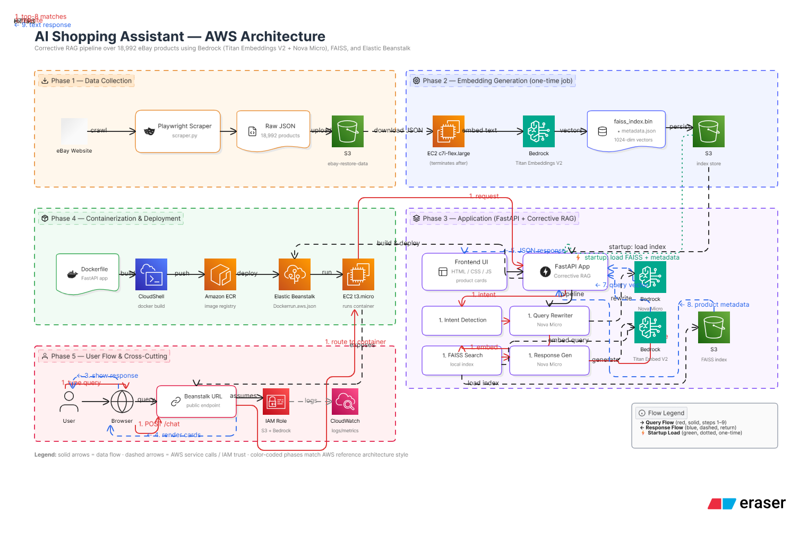

# 🛍️ AI Shopping Assistant

An intelligent eBay fashion shopping assistant powered by **Corrective RAG (CRAG)**, deployed on **AWS**. Users can search for clothing, shoes, bags, and accessories using natural language — the AI understands context, filters by price/condition, and shows relevant product cards with direct eBay links.

---

## 🌐 Live Demo

**URL:** `http://AI-Shopping-Assistance.us-east-1.elasticbeanstalk.com`

---

## 🏗️ Architecture Diagram




```
┌─────────────────────────────────────────────────────────────────┐
│                         USER BROWSER                            │
│                    (Responsive Web UI)                          │
└──────────────────────────┬──────────────────────────────────────┘
                           │ HTTP Request
                           ▼
┌─────────────────────────────────────────────────────────────────┐
│              AWS ELASTIC BEANSTALK (EC2 t3.micro)               │
│                                                                 │
│  ┌─────────────────────────────────────────────────────────┐   │
│  │              Docker Container (Python 3.12)              │   │
│  │                                                         │   │
│  │  FastAPI Application (main.py)                          │   │
│  │                                                         │   │
│  │  ┌─────────────────────────────────────────────────┐   │   │
│  │  │           CORRECTIVE RAG PIPELINE               │   │   │
│  │  │                                                 │   │   │
│  │  │  Step 1: Intent Detection                       │   │   │
│  │  │  ↓ (greeting vs product search)                │   │   │
│  │  │                                                 │   │   │
│  │  │  Step 2: Query Rewriter (Nova Micro)            │   │   │
│  │  │  ↓ "show me cheap womens dress"                │   │   │
│  │  │  → "women casual dress affordable low price"   │   │   │
│  │  │                                                 │   │   │
│  │  │  Step 3: FAISS Vector Search                    │   │   │
│  │  │  ↓ (loaded from S3 on startup)                 │   │   │
│  │  │  → Top 8 relevant products                     │   │   │
│  │  │                                                 │   │   │
│  │  │  Step 4: Response Generator (Nova Micro)        │   │   │
│  │  │  → Brief honest 2-3 sentence response          │   │   │
│  │  └─────────────────────────────────────────────────┘   │   │
│  └─────────────────────────────────────────────────────────┘   │
└──────────────────────────┬──────────────────────────────────────┘
                           │
          ┌────────────────┼────────────────┐
          ▼                ▼                ▼
┌─────────────┐  ┌─────────────────┐  ┌──────────────┐
│  Amazon S3  │  │  AWS Bedrock    │  │  Amazon ECR  │
│             │  │                 │  │              │
│ faiss_      │  │ Titan Embed V2  │  │ Docker Image │
│ index.bin   │  │ (Embeddings)    │  │ Repository   │
│             │  │                 │  │              │
│ metadata.   │  │ Nova Micro      │  └──────────────┘
│ json        │  │ (Chat LLM)      │
│             │  │                 │
│ ebay_data.  │  └─────────────────┘
│ json        │
└─────────────┘
```

---

## 🔧 AWS Services Used

| Service | Purpose | Cost Model |
|---|---|---|
| **Elastic Beanstalk** | Hosts the Docker container, manages EC2, load balancer, health checks | ~$8/month (t3.micro) |
| **EC2 (t3.micro)** | Runs the Docker container inside Elastic Beanstalk | Included in EB |
| **Amazon S3** | Stores FAISS index, metadata, eBay data, Docker build files | ~$0.01/month |
| **Amazon ECR** | Docker container registry | ~$0.01/month |
| **AWS Bedrock - Titan Embeddings V2** | Converts text queries to 1024-dim vectors for similarity search | $0.0001 per 1K tokens |
| **AWS Bedrock - Amazon Nova Micro** | Query rewriting, intent detection, response generation | $0.000035 per 1K tokens |
| **EC2 (c7i-flex.large)** | One-time job to generate FAISS embeddings (terminated after use) | One-time ~$0.50 |
| **IAM** | Roles and permissions for all services | Free |
| **CloudWatch** | Logs and monitoring | Free tier |

---

## 🤖 How Corrective RAG (CRAG) Works

Traditional RAG just retrieves and generates. CRAG adds a correction step:

```
User Query
    ↓
1. INTENT DETECTION
   Is this a greeting or a product search?
   → Greeting: respond conversationally
   → Search: continue to step 2

2. QUERY REWRITER (Nova Micro LLM)
   Corrects typos, expands abbreviations,
   extracts attributes (gender, color, size, price),
   uses conversation history for follow-up questions
   "show me cheap womens dress" → "women casual dress affordable"

3. VECTOR SEARCH (FAISS + Titan Embeddings)
   Converts rewritten query to 1024-dim vector
   Searches 18,992 eBay products by cosine similarity
   Applies post-retrieval filters:
   - Category filter (shoes/bags/dresses/trousers)
   - Price filter (under $X, over $X)
   - Condition filter (new/used)
   - Deduplication

4. RESPONSE GENERATOR (Nova Micro LLM)
   Generates honest 2-3 sentence response
   Only mentions what user asked for
   Accurately reflects actual prices found
   Never hallucinates product details
```

---

## 📁 Project Structure

```
ai-shopping-assistant/
│
├── main.py                 # FastAPI app — CRAG pipeline, API routes
├── Dockerfile              # Docker container definition
├── Dockerrun.aws.json      # Elastic Beanstalk Docker config
├── requirements.txt        # Python dependencies
│
├── static/
│   └── index.html          # Frontend — ChatGPT-style UI with product cards
│
├── data/
│   └── ebay_data.json      # Raw eBay product data (18,992 products)
│
├── ec2_embeddings.py       # Runs on EC2 to generate FAISS index → uploads to S3
├── ec2_setup.sh            # EC2 setup script (installs deps, runs embeddings)
├── ec2_requirements.txt    # Dependencies for EC2 embedding job
│
├── scraper.py              # eBay scraper (Playwright-based)
├── config.py               # Scraper configuration (40 categories)
├── embeddings.py           # Local embedding generation (alternative)
├── upload_to_s3.py         # Uploads files to S3
│
└── README.md               # This file
```

---

## 🚀 Deployment Guide

### Prerequisites
- AWS Account with credits
- AWS CLI configured
- Docker Desktop
- Python 3.12+

### Step 1 — Clone and Setup

```bash
git clone https://github.com/YOUR_USERNAME/ai-shopping-assistant.git
cd ai-shopping-assistant
python -m venv .venv
.venv/Scripts/activate  # Windows
pip install -r requirements.txt
```

### Step 2 — Configure Environment Variables

Create a `.env` file:

```env
AWS_ACCESS_KEY_ID=your_iam_access_key
AWS_SECRET_ACCESS_KEY=your_iam_secret_key
AWS_REGION=us-east-1
EMBEDDING_MODEL_ID=amazon.titan-embed-text-v2:0
CHAT_MODEL_ID=amazon.nova-micro-v1:0
S3_BUCKET=your-s3-bucket-name
S3_INDEX_KEY=embeddings/faiss_index.bin
S3_METADATA_KEY=embeddings/metadata.json
```

### Step 3 — Generate Embeddings on EC2

```bash
# Upload scripts to S3
python upload_to_s3.py

# Connect to EC2 via SSM
aws ssm start-session --target YOUR_INSTANCE_ID --region us-east-1

# On EC2:
cd /tmp && aws s3 cp s3://YOUR_BUCKET/scripts/ec2_setup.sh .
nohup bash ec2_setup.sh > embedding_log.txt 2>&1 &
```

This generates `faiss_index.bin` and `metadata.json` and uploads them to S3.

### Step 4 — Build and Push Docker Image

```bash
# Login to ECR
aws ecr get-login-password --region us-east-1 | docker login --username AWS --password-stdin YOUR_ACCOUNT_ID.dkr.ecr.us-east-1.amazonaws.com

# Build and push
docker build -t ai-shopping-assistant .
docker tag ai-shopping-assistant:latest YOUR_ACCOUNT_ID.dkr.ecr.us-east-1.amazonaws.com/ai-shopping-assistant:latest
docker push YOUR_ACCOUNT_ID.dkr.ecr.us-east-1.amazonaws.com/ai-shopping-assistant:latest
```

### Step 5 — Deploy to Elastic Beanstalk

1. Go to AWS Console → Elastic Beanstalk → Create environment
2. Platform: Docker
3. Upload `Dockerrun.aws.json`
4. Add environment variables (from `.env`)
5. Attach IAM role with S3 + Bedrock permissions
6. Deploy

### Step 6 — Run Locally

```bash
uvicorn main:app --reload --port 8000
# Open http://localhost:8000
```

---

## 💡 Features

- **Natural language search** — "show me women's dresses under $50 used"
- **Corrective RAG** — query rewriting improves retrieval accuracy
- **Smart filters** — price, condition, category applied automatically
- **Conversation memory** — follow-up questions use previous context
- **No duplicates** — deduplication by URL and product name
- **Honest responses** — never hallucinates prices or product details
- **ChatGPT-style UI** — scrollable feed, products stay visible
- **Responsive design** — works on mobile and desktop
- **New Chat button** — clears history and starts fresh

---

## 📊 Dataset

- **Source:** eBay USA fashion products
- **Size:** 18,992 products
- **Categories:** 40 categories across Men, Women, Kids clothing, shoes, bags
- **Fields:** product name, price, condition, seller, images, URL, item specifics

---

## 💰 Cost Estimate

| Usage | Monthly Cost |
|---|---|
| Elastic Beanstalk (t3.micro) | ~$8 |
| S3 storage (100MB) | ~$0.01 |
| ECR storage | ~$0.01 |
| Bedrock (10,000 queries) | ~$3 |
| **Total** | **~$11/month** |

---

## 🛠️ Tech Stack

| Layer | Technology |
|---|---|
| Backend | Python, FastAPI, Uvicorn |
| Vector Search | FAISS (Facebook AI Similarity Search) |
| Embeddings | Amazon Titan Embeddings V2 (1024 dimensions) |
| LLM | Amazon Nova Micro (via AWS Bedrock) |
| Frontend | Vanilla HTML/CSS/JavaScript |
| Container | Docker |
| Cloud | AWS (Elastic Beanstalk, S3, ECR, Bedrock, EC2) |

---

## 📝 License

**All Rights Reserved** — This project is free to view and use for personal/educational purposes only.

- ❌ No modifications allowed
- ❌ No redistribution allowed
- ❌ No commercial use allowed
- ✅ Free to view and learn from
- ✅ Free to use locally for personal projects

Copyright © 2026 Imran Rafique. All rights reserved.
